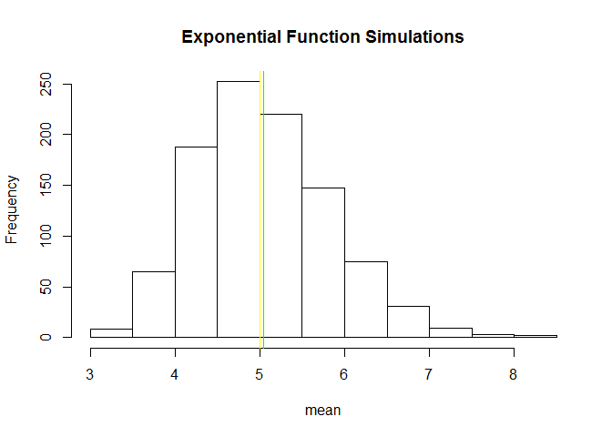
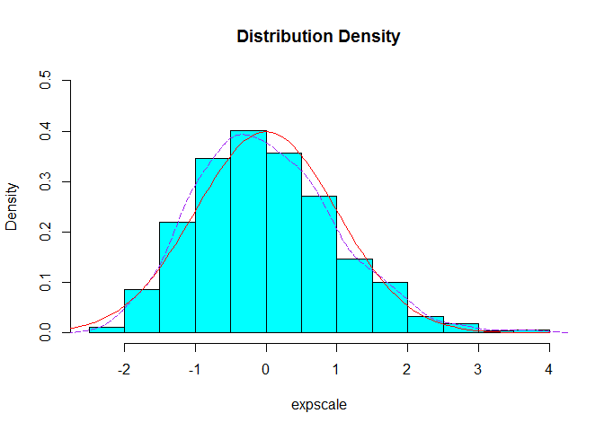

# Statistical Inference Course Project - Part 1
Alex McBride  
Friday, February 06, 2015  

## Synopsis

Investigate the exponential distribution in R and compare it with the Central Limit Theorem. The exponential distribution can be simulated with `rexp(n, lambda)` where lambda is the rate parameter. The mean of exponential distribution is $\frac{1}{\Lambda}$ (1/lambda) and the standard deviation is also $\frac{1}{\Lambda}$. Set $\Lambda$ = 0.2 for all of the simulations. Investigate the distribution of averages of 40 exponentials running 1000 simulations.

Illustrate via simulation and associated explanatory text the properties of the distribution of the mean of 40 exponentials.  Complete these tasks    
1. Show the sample mean and compare it to the theoretical mean of the distribution.  
2. Show how variable the sample is (via variance) and compare it to the theoretical variance of the distribution.  
3. Show that the distribution is approximately normal.  

## Create the Distribution


```r
# set seed for reproducability
set.seed(10)

# set lambda to 0.2
lambda <- 0.2

# 40 samples
n <- 40

# 1000 simulations
sim <- 1000

# simulate
sim_exp <- replicate(sim, rexp(n, lambda))

# calculate mean of exponentials
means_exp <- apply(sim_exp, 2, mean)
```

### Show and compare the distribution mean and variance

Theoretical mean is `1/lambda` = 5

Our analytical mean is `mean(means_exp)` = 5.0450596

We can show this with the following histogram which shows the distribution of the simulation means and the theoretical and analysed mean of these means.

```r
hist(means_exp, xlab = "mean", main = "Exponential Function Simulations")
abline(v = mean(means_exp), col = "green")
abline(v = 1/lambda, col = "yellow")
```

 

The yellow line marks the theoretical mean, where as the green line is our mean result from this simulation. Using the Central Limit Theorem if we were to run more simulations, we would expect the green line (analysed mean) to move closer to the yellow line (theoretical mean).


The theoretical standard deviation is `1/lambda/sqrt(n)` = 0.7905694

Our analytical standard deviation is `sd(means_exp)` = 0.7982821

The theoretical variance is `((1/lambda)*(1/sqrt(n)))^2` = 0.625

Our analytical variance is `var(means_exp)` = 0.6372544


### Show that the distribution is approximately normal


```r
expscale <- scale(means_exp)
hist(expscale,probability=T, main="Distribution Density", col = "cyan",
     ylim=c(0, 0.5), xlim=c(-4,4))
lines(density(expscale), col = "purple", pch = 22, lty=5)
# Compare with the standard normal distribution
curve(dnorm(x,0,1), -4, 4, col="red", add=T)
```

 

