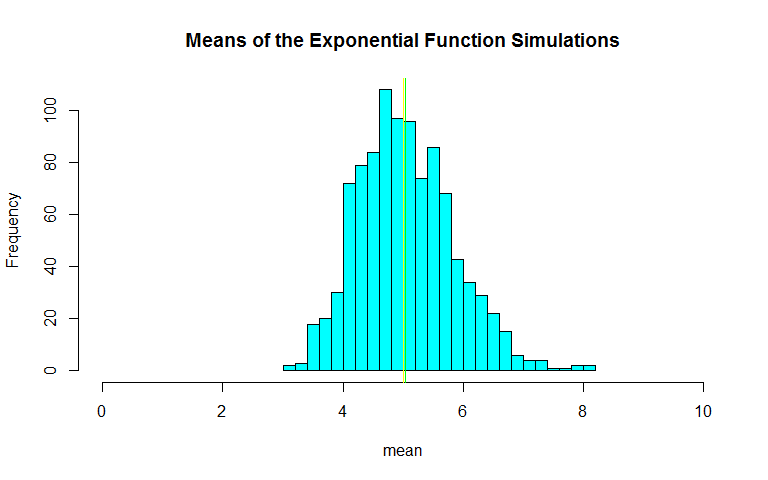
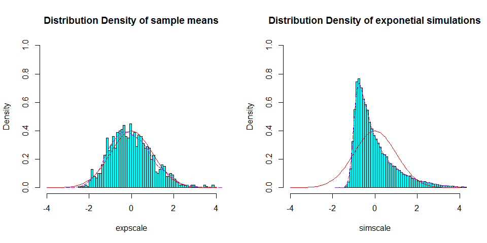

# Statistical Inference Course Project - Part 1
Alex McBride  
Saturday, February 07, 2015  

## Synopsis

Investigate the exponential distribution in R and compare it with the Central Limit Theorem. The exponential distribution can be simulated with `rexp(n, lambda)` where lambda ($\Lambda$) is the rate parameter. The mean of exponential distribution is $\frac{1}{\Lambda}$ (1/lambda) and the standard deviation is also $\frac{1}{\Lambda}$. Set $\Lambda$ = 0.2 for all of the simulations. Investigate the distribution of averages of 40 exponentials running 1000 simulations and then
   
1. Show the sample mean and compare it to the theoretical mean of the distribution.  
2. Show how variable the sample is (via variance) and compare it to the theoretical variance of the distribution.  
3. Show that the distribution is approximately normal.  

## Show the Distribution


```r
# Create the distribution
set.seed(10) # set seed for reproducability
lambda <- 0.2 # set lambda to 0.2
n <- 40 # 40 samples
sim <- 1000 # 1000 simulations
sim_exp <- replicate(sim, rexp(n, lambda)) # run simulations
means_exp <- apply(sim_exp, 2, mean) # calculate mean of exponentials
```

### Show and compare the sample mean vs theoretical mean

Theoretical mean is `1/lambda` = 5  
Our analytical mean is `mean(means_exp)` = 5.0450596  
These results are within 0.89% of each other, which is very close. We can show this with the following histogram which shows the distribution of the simulation means and the theoretical and analysed mean of these means.

```r
# Histogram of the mean of each simulation
hist(means_exp, xlab = "mean", main = "Means of the Exponential Function Simulations",
     xlim = c(0, 10), breaks = 20, col = "cyan")
abline(v = mean(means_exp), col = "green")
abline(v = 1/lambda, col = "yellow")
```

 

The yellow line marks the theoretical mean, where as the green line is our mean result from this simulation. Using the Central Limit Theorem if we were to run more simulations, we would expect the green line (analysed mean) to move closer to the yellow line (theoretical mean).

### How variable is the sample vs theoretical variance

The theoretical standard deviation is `1/lambda/sqrt(n)` = 0.7905694  
Our analytical standard deviation is `sd(means_exp)` = 0.7982821  
The two standard deviation results are within 0.97% of each other, which is very close.  
The theoretical variance is `((1/lambda)*(1/sqrt(n)))^2` = 0.625  
Our analytical variance is `var(means_exp)` = 0.6372544  
The two variance results are within 1.92% of each other, which, once again, is a very close result. If we ran more simulations and took their means, we would expect the analysed standard deviations and variances to move even closer to the theoretical results.

### Show that the distribution is approximately normal


```r
par(mfrow = c(1,2))
# Scaled histogram of the distribution vs normal distrbution curve
expscale <- scale(means_exp)
hist(expscale,probability=T, main="Distribution Density of sample means", col = "cyan",
     ylim=c(0, 1), xlim=c(-4,4), breaks = 64)
lines(density(expscale), col = "purple", pch = 22, lty=5)
# Compare with the standard normal distribution
curve(dnorm(x,0,1), -4, 4, col="red", add=T) 
# Scaled Density histogram of the collection of random exponentials
simscale <- scale(sim_exp)
hist(simscale,probability=T, main="Distribution Density of exponetial simulations", col = "cyan",
     ylim = c(0,1), xlim=c(-4,4), breaks = 64)
lines(density(simscale), col = "purple", pch = 22, lty=5)
# Compare with the standard normal distribution
curve(dnorm(x,0,1), -4, 4, col="red", add=T) 
```

 

From these histograms we can see that the distribution of our averaged exponentials is approximately normal. As we run more simulations and take their means, the analysed distribution curve would look more and more like the "standard normal distribution curve". Whereas, if we compare that to the distribution of the exponentials before we took the mean, we see that this distribution is not near normal. If we run more simulations, we would find that this density plot would look less and less like a "standard normal distribution".

## Further Reading

To get a more in-depth view of exponential distributions see [Exponential Distribution](http://en.wikipedia.org/wiki/Exponential_distribution) on Wikipedia
